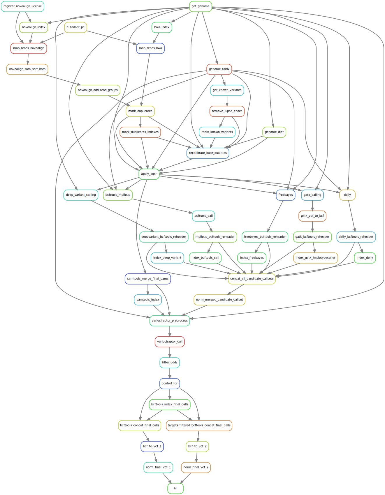

# Whole Exome Seq pipeline
## Background
As part of a set of analysis pipeline comparisons organized by the West German Genome Center, this particular workflow is designed to analyze Whole Exome Sequencing samples.  
Input data was provided in the form of ~80x coverage WES Agilent SureSelect data set of sample NA12878 and a .bed target file.  
Results from all participants were compared to a gold standard set in Cologne with Illumina's [hap.py](https://github.com/Illumina/hap.py).
  
##  :open_book: About the workflow  
A stripped down yet extended version of the [dna-seq-varlociraptor](https://github.com/snakemake-workflows/dna-seq-varlociraptor) pipeline by Johannes Köster's team from the university of Duisburg-Essen.  
"Stripped down" in the sense that most annotation, report and multi-sample features were removed and all focus is put on the variant calling itself.  
"Extended" since based on results of [Kumaran et al. 2019](https://bmcbioinformatics.biomedcentral.com/articles/10.1186/s12859-019-2928-9) my approach was to integrate the results of more than one alignment software and a plethora of variant callers.  
Alignment is performed by both bwa-mem and a Novoalign Vv4.02.02 (Licensed for evaluation, educational, and not-for-profit use only). Both alignments are subsequently used for calling of candidate variants with GATK, samtools, freebayes, DeepVariant & Delly.  
Variants are then joined across all callers with bcftools concat/norm (not perfect since some information is lost in the process).  
I used [Varlociraptor](https://github.com/varlociraptor/varlociraptor) to produce a final call set and filter it.  

It is important to note that normalization and integration of similar variant calling software is a matter of ongoing research and the quick & dirty solution here is unlikely to be optimal.  
A comparison to highly optimized and established variant calling pipelines based on a single caller is nevertheless very interesting and motivated this entry into the WGGC comparison effort.

## :beginner: Usage
- Set parameters inside config.yaml (e.g. choice of reference genome).
- Inside `workflow/Snakefile` adapt SAMPLES = ['XXX'] to the base name of the samples you are analyzing.
- Adapt samples.tsv to your use case.
- Deposit a valid NovoAlign v4 license (`novoalign.lic`) inside config/licenses/.
  
Software will be installed at runtime.  
To run the analysis enter:  
```
snakemake --cores xx --use-conda
```

## :framed_picture: DAG representation of the workflow

